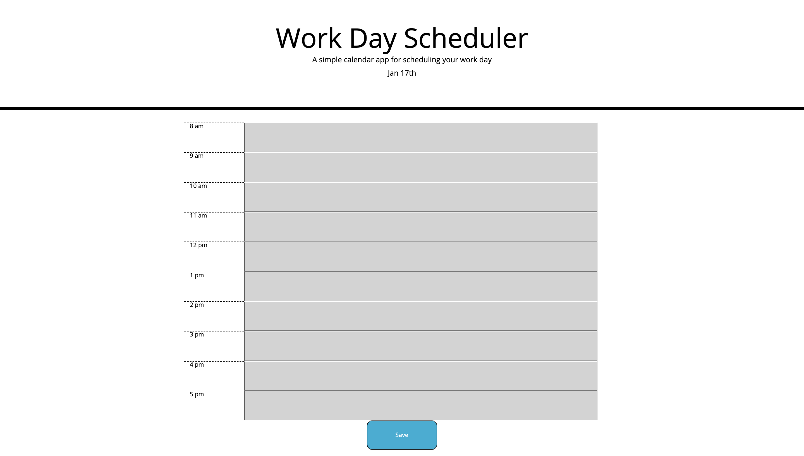
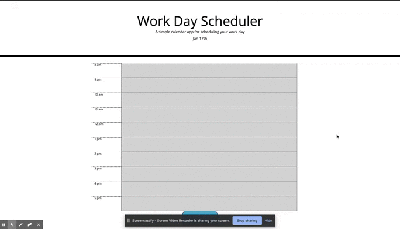

# Calendar

## User Story
There are many powerful calendar apps available that give users a wide range of tools to keep tracking of their busy lives. However what about a simple calendar application that only shows a users tasks for just today? An application that allows a user to set agendas, tasks, reminders for today only? This calendar application seeks to meet that very need.

## Overview

For this web application I had to write a script that references a third party api called moment. 

Using moment I set set up this calendar app that will do the following:
  1) put the past time block/s to be set to the css style for "past"
  2) put the current time block to be set to the css style for "present"
  3) put the future time block/s to be set to the css style for "future
  4) put todays date at the top of the page.
  
I also had to write a script that will keep the tasks that are typed in each time block to be stored in local storage and then called when the page is reloaded so that all "typed events" are saved. This script also had to be put to an on click event to a save button. 

## How to use
To use the application start by selecting which time block you want to add a task to 

## Things I learned

Over all this project was fairly straight foward. Using JQuery made much of this fairly easy. In order to get the past, present, and future time blocks to have a certain css style I had to create a for loop that ran through an array that I set up to make sure that only business hours were presented. With this for loop I was then able to create a conditional statement that would determine if the time block was in the past, present, or future. 

While this was fairly straight foward there were a few puzzle pieces that had to be solved. 

The first puzzle piece was because I was using moment I had to turn the strings in my array into a momemt object and then compare that momemnt object to another moment object which was set for the current time. 

The second puzzle piece was because my current time moment object had a format of hour and time of day ("h a") this turned my current time moment object into an array as well so I had to turn that moment object, which became a string, back to a moment object. The reason for this back and forth is because the strings in my array were set to have a specific format of time and time of day (i.e. 9 am or 12 pm). So if I didn't have that specific format then I probably could have just turned my strings into a moment object and then just compare my "object strings" to moment(). However because I wanted to have a certain format then my current time moment object had to have the same format in order for them to be compared correctly. 

The solve for this second puzzle piece was: moment(moment(), "h a"). The first moment takes what is inside of it's parenthesis, which becomes a string because of format, and turns it back to a moment object. 

## Future Implementations
In the future I would like to add the following:
-Finished tasks section to see what was accomplished in the past
-Checklist function that rolls unfinished tasks to the next day and finished tasks to finished tasks section
-

## Technologies Used
-JQuery
-CSS
-Moment

